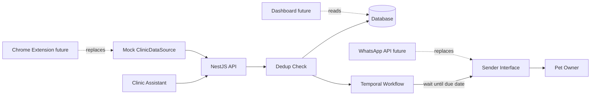

# Clinic Reminder System - Architecture

Project: [[clinic-reminder-system]]
Specification: [[clinic-reminder-system-specification]]

## V0 service-level diagram

V0 excludes WhatsApp, dashboard, and real clinic-system ingestion. It proves reminder creation, deduplication, durable scheduling, and stubbed delivery.

### V0 standalone description

V0 is the smallest runnable version of the system. A clinic assistant creates a reminder through the NestJS API. The backend checks whether the reminder is a duplicate, stores it in the application database, and starts a Temporal workflow. Temporal owns the durable wait until the due time. When the timer fires, a Temporal worker runs a send activity. The activity calls a `Sender` interface, which is implemented as a console/manual-handoff stub in V0.

V0 has three deployed services:

| Deployed service | Responsibility |
|---|---|
| NestJS API | HTTP boundary, reminder creation, deduplication, database writes, Temporal workflow start. |
| Temporal Worker | Executes reminder workflow code and send activities. |
| Temporal Server | Stores workflow state, timers, history, and durability metadata. |

V0 has two databases:

| Database | Owned by | Stores |
|---|---|---|
| App DB | NestJS app | reminders, cases, phone numbers, sent status. |
| Temporal persistence DB | Temporal server | workflow history, timers, execution state. |

V0 data flow:

1. Assistant calls `POST /reminders`.
2. `ReminderController` passes input to `ReminderService`.
3. `ReminderService` asks `DedupService` whether this reminder already exists.
4. `ReminderRepository` uses Drizzle to check and write to the App DB.
5. If not duplicate, `ReminderService` starts a `ReminderWorkflow` through the Temporal client.
6. Temporal persists the workflow and durable timer.
7. When the due time arrives, the Temporal Worker executes `SendReminderActivity`.
8. `SendReminderActivity` calls `Sender.send()`.
9. `ConsoleSender` logs the reminder or produces a manual handoff.
10. The activity marks the reminder as sent in the App DB.

V0 deliberately keeps these out:

- WhatsApp delivery.
- Inbound replies.
- Dashboard.
- Chrome-extension ingestion.
- LLM classification.
- Follow-up branching workflows.

```mermaid
flowchart LR
  Assistant["Clinic Assistant"]

  subgraph Backend["Deployed service: NestJS API"]
    ReminderController["ReminderController"]
    ReminderService["ReminderService"]
    DedupService["DedupService"]
    ClinicDataSource["Mock ClinicDataSource"]
    ReminderRepo["ReminderRepository / Drizzle"]
    TemporalClient["Temporal Client"]
  end

  subgraph Worker["Deployed service: Temporal Worker"]
    ReminderWorkflow["ReminderWorkflow"]
    SendActivity["SendReminderActivity"]
    Sender["Sender interface"]
    ConsoleSender["ConsoleSender stub"]
  end

  subgraph TemporalSvc["Deployed service: Temporal Server"]
    TemporalServer["Temporal Frontend / History"]
    Timer["Durable timer"]
  end

  AppDB[("App DB: reminders / cases / phones")]
  TemporalDB[("Temporal persistence DB")]
  Owner["Pet Owner"]

  Assistant -->|"POST /reminders"| ReminderController
  ClinicDataSource -->|"mock reminder candidate"| ReminderService
  ReminderController --> ReminderService
  ReminderService --> DedupService
  DedupService -->|"check duplicate key"| ReminderRepo
  ReminderRepo --> AppDB
  ReminderService -->|"insert reminder"| ReminderRepo
  ReminderService -->|"start workflow"| TemporalClient
  TemporalClient --> TemporalServer

  TemporalServer --> Timer
  TemporalServer --> TemporalDB
  Timer -->|"due time reached"| ReminderWorkflow
  ReminderWorkflow --> SendActivity
  SendActivity --> Sender
  Sender --> ConsoleSender
  ConsoleSender -->|"log / manual handoff"| Owner
  SendActivity -->|"mark sent"| ReminderRepo
```



## Planning diagram

```mermaid
flowchart LR
  %% USERS
  Assistant["Clinic Assistant"]
  Vet["Veterinarian"]
  Owner["Pet Owner"]

  %% EXISTING / OUTSIDE
  ClinicSystem["Existing Clinic System"]

  %% V1 SYSTEM
  subgraph V1["V1: Automated Reminders"]
    MockSource["Mock ClinicDataSource"]
    API["NestJS Backend"]
    Dedup["Dedup / Idempotency"]
    DB[("SQLite local / Postgres later")]
    Temporal["Temporal Server"]
    ReminderWF["Reminder Workflow"]
    Sender["Delivery Interface"]
  end

  %% FUTURE SYSTEM
  subgraph V2["V2: WhatsApp Follow-ups"]
    WhatsApp["WhatsApp API"]
    ReplyWebhook["Inbound Reply Webhook"]
    FollowupWF["Follow-up Workflow"]
    Classifier["LLM Severity Classifier"]
  end

  subgraph V3["V3: Real Ingestion + Dashboard"]
    ChromeExt["Chrome Extension"]
    Dashboard["Vet Dashboard"]
  end

  %% V1 FLOW
  Assistant -->|"creates or imports reminder"| MockSource
  MockSource --> API
  API --> Dedup
  Dedup --> DB
  Dedup --> Temporal
  Temporal --> ReminderWF
  ReminderWF -->|"due date reached"| Sender
  Sender -->|"log / manual handoff"| Owner

  %% FUTURE INGESTION
  ClinicSystem -.->|"inspected later"| ChromeExt
  ChromeExt -.->|"replaces mock source"| API

  %% FUTURE MESSAGING
  Sender -.->|"replaced by"| WhatsApp
  WhatsApp -.->|"sends message"| Owner
  Owner -.->|"replies"| ReplyWebhook
  ReplyWebhook -.->|"signals"| FollowupWF
  FollowupWF -.->|"classifies reply"| Classifier
  Classifier -.->|"low severity"| WhatsApp
  Classifier -.->|"high severity"| Dashboard
  Dashboard -.->|"reviewed by"| Vet

  %% DASHBOARD DATA
  API -.->|"case/reminder state"| Dashboard
  DB -.->|"read statuses"| Dashboard
```



## V1 coding diagram



## Living sketch

```text
[Mock Data] → [NestJS API] → [Dedup] → [DB]
                                │
                                ▼
                         [Temporal Workflow]
                                │ wait
                                ▼
                         [Sender Interface]
                                │
                                ▼
                          [Pet Owner]
```
