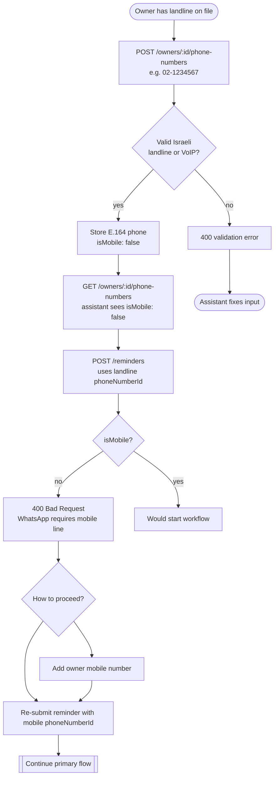
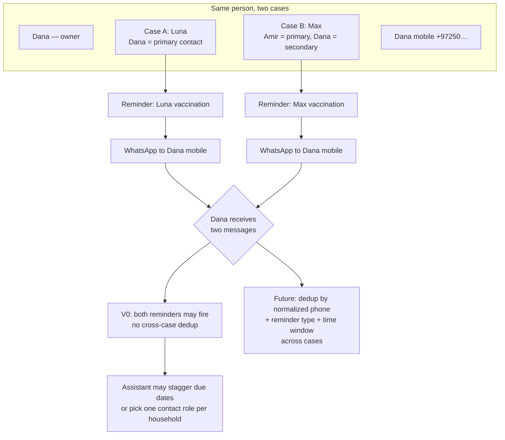

# Clinic Reminder System — V0 user flows

Project: [[clinic-reminder-system]]
Specification: [[clinic-reminder-system-specification]]
Architecture: [[clinic-reminder-system-architecture]]

V0 covers the clinic assistant manually creating entities through the API and scheduling a reminder. Delivery is stubbed (console/log), but the product assumption is **WhatsApp on mobile numbers only**.

## Entity relationships

### Intended domain model

Phone numbers belong to **owners** (people). **Cases** (pets) link to one or more owners. For each case, the clinic designates how to reach the household about **that pet**:

| Concept | Meaning |
|---|---|
| **Owner** | A person — may be linked to many cases (multiple pets, or co-owner on someone else's pet). |
| **Case** | A pet under care at the clinic. |
| **Owner ↔ case** | Many-to-many: one owner can have several cases; one case can have several owners (e.g. household). |
| **Phone number** | A contact line stored on an **owner** record (mobile, landline, or VoIP). |
| **Primary phone (per case)** | The main WhatsApp number used for reminders about **this pet**. Usually the primary owner's mobile. |
| **Secondary phone (per case)** | A backup contact for **this pet** — often a spouse or co-owner's mobile, or a second number for the same person. |

```mermaid
erDiagram
  OWNER ||--o{ PHONE_NUMBER : has
  OWNER }o--o{ CASE : linked_via_case_owners
  CASE ||--o| PHONE_NUMBER : primary_contact
  CASE ||--o| PHONE_NUMBER : secondary_contact
  CASE ||--o{ REMINDER : schedules
  REMINDER }o--|| PHONE_NUMBER : delivers_to

  OWNER {
    string id
    string name
  }
  CASE {
    string id
    string petName
  }
  PHONE_NUMBER {
    string id
    string phone E164
    boolean isMobile
  }
  REMINDER {
    string id
    string reminderType
    string dueAt
  }
```

**Example:** Dana owns Luna (case A) and is co-owner on Max (case B, with Amir as primary). Luna's reminders go to Dana's mobile as **primary** on case A. Max's reminders might go to Amir's mobile as **primary** and Dana's mobile as **secondary** on case B — same person, two roles across two cases.

### V0 implementation gap

V0 does **not** yet store primary/secondary phones on a case. Phones live on owners; the assistant picks `caseId`, `ownerId`, and `phoneNumberId` explicitly when calling `POST /reminders`. The diagrams below describe target assistant behavior; the API shape will evolve when case-level contact designations are added.

## Business rules (V0)

| Rule | Behavior |
|---|---|
| Phone storage | Valid Israeli mobile, landline, and VoIP numbers may be added to an owner. |
| WhatsApp eligibility | Only **Israeli mobile** numbers (`isMobile: true`) may be used when creating a reminder. |
| Non-mobile edge case | Landline or VoIP on file → `POST /reminders` returns **400** with a clear error; no workflow is started. |

## Primary flow — schedule a WhatsApp reminder

```mermaid
flowchart TD
  Start([Clinic assistant starts]) --> CreateOwner[POST /owners<br/>create owner]
  CreateOwner --> AddMobile[POST /owners/:id/phone-numbers<br/>add Israeli mobile]
  AddMobile --> MobileOk{Valid Israeli<br/>mobile?}
  MobileOk -->|no| RejectPhone[400 validation error]
  MobileOk -->|yes| StoreMobile[Store E.164 phone<br/>isMobile: true]
  StoreMobile --> CreateCase[POST /cases<br/>create pet case]
  CreateCase --> LinkOwner[POST /cases/:id/owners<br/>link owner(s) to case]
  LinkOwner --> PickContact[Choose primary mobile for this case<br/>V0: manual phoneNumberId]
  PickContact --> CreateReminder[POST /reminders<br/>case + owner + mobile phone]
  CreateReminder --> Checks{Case, owner link,<br/>phone ownership,<br/>isMobile?}
  Checks -->|fail| RejectReminder[400 / 404 error]
  Checks -->|pass| Persist[Insert reminder pending]
  Persist --> StartWorkflow[Start Temporal ReminderWorkflow]
  StartWorkflow --> WaitDue[Workflow sleeps until dueAt]
  WaitDue --> SendStub[SendReminderActivity<br/>stub delivery]
  SendStub --> MarkSent[Mark reminder sent]
  MarkSent --> Done([Owner would receive WhatsApp in V2])

  RejectPhone --> EndFail([Assistant fixes input])
  RejectReminder --> EndFail
```

## Edge case — landline or VoIP on file

An owner may have a home landline or VoIP number for contact records. Those numbers are accepted at `POST /owners/:id/phone-numbers` but **must not** be used for reminders.



## Edge case — duplicate reminder across cases (same phone, two roles)

A person can be the **primary** contact on one case and the **secondary** contact on another. If both pets get a reminder around the same time, the **same mobile number** may receive two WhatsApp messages — one per case — even though the recipient is one person.

**Not implemented in V0.** Documented here for assistant awareness and future deduplication design.



| Situation | V0 behavior | Future direction |
|---|---|---|
| Dana primary on Luna, secondary on Max | Two separate `POST /reminders` → two workflows → two messages to same number | Deduplicate delivery when `normalizedPhone` + `reminderType` + due window collide, regardless of case |
| Same pet, duplicate create | Not fully enforced in V0 | Spec calls for DB + app-level dedup per phone/type/window |
| Landline on secondary slot | 400 if non-mobile selected | Case-level primary/secondary validation when model is implemented |

## API touchpoints

| Step | Endpoint | Success | Failure |
|---|---|---|---|
| Create owner | `POST /owners` | 201 owner | 400 validation |
| Add phone | `POST /owners/:id/phone-numbers` | 201 phone (`isMobile` set) | 400 invalid number / 404 owner |
| List phones | `GET /owners/:id/phone-numbers` | 200 array with `isMobile` | 404 owner |
| Create case | `POST /cases` | 201 case | 400 validation |
| Link owner | `POST /cases/:id/owners` | 201 link | 404 / 400 |
| Create reminder | `POST /reminders` | 201 reminder + workflow | 400 non-mobile phone / unlinked owner / 404 |

## Assistant checklist

1. Create or find the pet owner(s).
2. Add at least one **mobile** number (`05x…`) per owner who should receive WhatsApp.
3. Optionally add landline/VoIP for records — do not select these for reminders.
4. Create the pet case and link all relevant owners.
5. For each case, decide **primary** and **secondary** contact numbers (V0: choose manually at reminder creation; later: stored on the case).
6. Create the reminder using the correct **mobile** `phoneNumberId` for that case's contact role.
7. Watch for **cross-case duplicates** when the same mobile is primary on one pet and secondary on another — stagger or consolidate manually in V0.
8. Poll `GET /reminders/:id` until `status` is `sent` (V0 stub).
