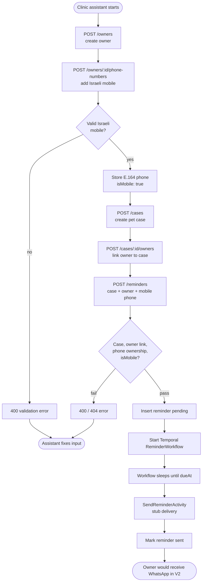

# Clinic Reminder System — V0 user flows

Project: [[clinic-reminder-system]]
Specification: [[clinic-reminder-system-specification]]
Architecture: [[clinic-reminder-system-architecture]]

V0 covers the clinic assistant manually creating entities through the API and scheduling a reminder. Delivery is stubbed (console/log), but the product assumption is **WhatsApp on mobile numbers only**.

## Business rules (V0)

| Rule | Behavior |
|---|---|
| Phone storage | Valid Israeli mobile, landline, and VoIP numbers may be added to an owner. |
| WhatsApp eligibility | Only **Israeli mobile** numbers (`isMobile: true`) may be used when creating a reminder. |
| Non-mobile edge case | Landline or VoIP on file → `POST /reminders` returns **400** with a clear error; no workflow is started. |

## Primary flow — schedule a WhatsApp reminder

## Edge case — landline or VoIP on file

An owner may have a home landline or VoIP number for contact records. Those numbers are accepted at `POST /owners/:id/phone-numbers` but **must not** be used for reminders.

## API touchpoints

| Step | Endpoint | Success | Failure |
|---|---|---|---|
| Create owner | `POST /owners` | 201 owner | 400 validation |
| Add phone | `POST /owners/:id/phone-numbers` | 201 phone (`isMobile` set) | 400 invalid number / 404 owner |
| List phones | `GET /owners/:id/phone-numbers` | 200 array with `isMobile` | 404 owner |
| Create case | `POST /cases` | 201 case | 400 validation |
| Link owner | `POST /cases/:id/owners` | 201 link | 404 / 400 |
| Create reminder | `POST /reminders` | 201 reminder + workflow | 400 non-mobile phone / unlinked owner / 404 |

## Assistant checklist

1. Create or find the pet owner.
2. Add at least one **mobile** number (`05x…`) for WhatsApp.
3. Optionally add landline/VoIP for records — do not select these for reminders.
4. Create the pet case and link the owner.
5. Create the reminder using the **mobile** `phoneNumberId`.
6. Poll `GET /reminders/:id` until `status` is `sent` (V0 stub).
