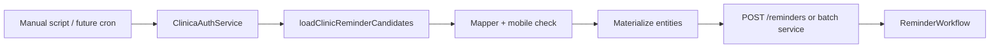

# V0 — LoadClinicReminders (Clinica Online)

Project: [[clinic-reminder-system]]
Login / session: [[v0-clinica-login]]
Resolve interceptors: [[v0-reminder-resolve-interceptors]]
External resolve context: [[v0-external-resolve-before-reminder]]
HAR evidence: local `examples/03-clinica-online-auth/04-load-clinic-reminders.har` (gitignored). Tests use sanitized [`test/fixtures/clinica/load-clinic-reminders.json`](../../test/fixtures/clinica/load-clinic-reminders.json).

**Status:** API client implemented (`ClinicaApiService.loadClinicReminders`); **not yet** wired to `ClinicDataSource.listReminderCandidates()` or `POST /reminders`.

## Purpose

Fetch the clinic’s **daily reminder list** from Clinica Online — the same data the vet staff see in the patient-list UI — so we can:

1. Discover who needs outreach today
2. Map rows to V0 reminder intents (owner, case/pet, phone, message, due time)
3. Eventually upsert into Supabase and schedule via Temporal

This is the **first Clinica feature** after auth (HAR sequence 01 → 02 → **04**).

## HAR summary (`04-load-clinic-reminders.har`)

| # | Method | Path | Status | Crucial? |
|---|--------|------|--------|----------|
| **0** | **POST** | **`/Restricted/dbCalander.asmx/LoadClinicReminders`** | **200** | **Yes** |
| 1–2 | GET | UI images | 200 | No |

**Prerequisite:** authenticated session from [[v0-clinica-login]] (login + branch). Same referer page as `GetLastPatients`: `/vetclinic/therapists/patientlistvet.aspx`.

### Request (HAR entry 0)

```
POST /Restricted/dbCalander.asmx/LoadClinicReminders
Content-Type: application/json; charset=UTF-8
X-Requested-With: XMLHttpRequest
Referer: …/vetclinic/therapists/patientlistvet.aspx

{
  "SelectedCat": "13",
  "forExcel": 0,
  "AllBranches": 1,
  "SelectedEmp": "",
  "GetConfirmed": 1,
  "TherapistID": "",
  "sEventDate": "",
  "fromDate": "07/01/2026",
  "toDate": "07/01/2026",
  "addOrSubstract": 1
}
```

| Field | HAR value | Meaning (inferred) |
|-------|-----------|-------------------|
| `SelectedCat` | `"13"` | Reminder **category filter** in Clinica UI (Florentin capture) |
| `fromDate` / `toDate` | `07/01/2026` | Single day range, **US `MM/DD/YYYY`** |
| `AllBranches` | `1` | Include all branches (vs branch-scoped list) |
| `GetConfirmed` | `1` | Include confirmed items |
| `addOrSubstract` | `1` | Date navigation direction (UI pager) |
| `forExcel` | `0` | Not an export |

**Config:** `CLINICA_REMINDER_CATEGORY_ID=13` (default in code).

### Response

```json
{ "d": [ { "__type": "RegSessionRem", … }, … ] }
```

HAR returned **15** rows for **2026-07-01**.

## RegSessionRem → V0 mapping

| Clinica field | Example | V0 / our model |
|---------------|---------|----------------|
| `EventID` | `2488388` | **`externalEventId`** — dedup key (not in schema yet) |
| `PatientID` | GUID | **`externalOwnerId`** → `owners.external_owner_id` |
| `PetID` | `83517` | **`externalCaseId`** → `cases.external_case_id` |
| `PatientName` | `בעלים 1 + חיה 83517` | Parse → `ownerName` + `petName` |
| `CellPhone` | `0500000001` | Normalize → `phone_numbers` (must be mobile for WhatsApp) |
| `Reminder` | Hebrew free text | **`message`** on reminder |
| `Date` | `7/1/2026 12:00:00 AM` | **`dueAt`** (reminder due date) |
| `DateEvent` | `6/28/2026 8:10:00 PM` | Prior visit / event (context, not due) |
| `FollowCatID` | `13` | Clinica category; maps loosely to `reminderType` |
| `Confirmed` | `0` / `1` | Staff “done” tick — **`0` = open**, filter with `loadOpenClinicReminderCandidates()` |
| `TherapistName` | `בעלים 1` | Metadata / logging (sanitized fixture) |
| `Treatment` | often empty | Not reliable for type inference in HAR |

### Reminder type mapping (V0 heuristic)

Our API accepts: `vaccination` | `visit` | `follow_up` | `general`.

**Scope:** This endpoint is the **staff follow-up queue** (`SelectedCat: 13`). Vaccination outreach uses a **separate Clinica flow** (`GetVaccineReminders`, etc.) — see [API-MAP.md](../../examples/03-clinica-online-auth/API-MAP.md).

Clinica does **not** return our enum on `LoadClinicReminders`. Current mapper (`inferReminderType`):

1. Hebrew/English keywords in `Reminder` text → `visit` / `general` (etc.)
2. `FollowCatID === 13` → `follow_up` (matches this HAR)
3. Else → `general`

Do not infer `vaccination` from this list — HAR `04` has no vaccine rows.

**Open:** confirm category `13` label in Clinica UI; may always imply follow-up for this clinic.

## SearchByPhone — owner enrichment

After loading open reminders (`Confirmed === 0`), call **`SearchByPhone`** with each row’s `CellPhone` to resolve full owner details (first/last name, email, `PetsList`).

```
POST /Restricted/dbCalander.asmx/SearchByPhone
{"PhoneNumber":"0500000002","UserID":"","LastName":""}
```

Response: `{ "d": RegPersonal[] }` — tie-break on `UserID === PatientID` from the reminder row.

| Method | Role |
|--------|------|
| `loadOpenClinicReminderCandidates()` | Open reminders only |
| `searchByPhone({ phoneNumber })` | Owner lookup |
| `loadOpenRemindersWithOwnerDetails()` | Combined flow (phone cache per batch) |

## Cross-inspect: V0 reminder needs

### What V0 `POST /reminders` requires today

| Field | Source after integration |
|-------|--------------------------|
| `caseId` | UUID — upsert from `PetID` |
| `ownerId` | UUID — upsert from `PatientID` |
| `phoneNumberId` | UUID — upsert from `CellPhone` (mobile check) |
| `reminderType` | Mapped from Clinica row (heuristic) |
| `message` | `Reminder` text |
| `dueAt` | ISO from `Date` |

### What [[v0-reminder-resolve-interceptors]] adds

| Step | LoadClinicReminders role |
|------|--------------------------|
| Batch discovery | **`listReminderCandidates()`** calls this endpoint for **today** |
| Single create | **`resolveReminderContext({ externalCaseId: PetID, externalOwnerId: PatientID })`** — may skip list if IDs known |
| Upsert | `external_owner_id`, `external_case_id` + phone normalize |
| Interceptors | Rewrite body → internal UUIDs → existing `RemindersService` |

### Gap analysis

| Need | Status |
|------|--------|
| Auth + session | Done — [[v0-clinica-login]] / `ClinicaApiService` |
| Fetch reminder list | Done — `loadClinicReminders()` |
| Map to candidate DTO | Done — `loadClinicReminderCandidates()` |
| `external_*` DB columns | **Not migrated** |
| `ClinicDataSource.listReminderCandidates()` real impl | **Not wired** |
| Mobile validation (`isMobile`) | **Not applied** in mapper |
| Dedup by `EventID` | **Not in schema** — recommend `external_event_id` unique on reminders |
| `AllBranches: 1` vs branch-only | HAR uses all branches; may need `AllBranches: 0` after Florentin branch select |
| Wire to Temporal | **Future** — batch job or per-row `POST /reminders` |

### Recommended V0 vertical slice (next)



1. Run `loadClinicReminderCandidates({ date: today })`
2. For each row with valid mobile + `dueAt`: upsert owner/case/phone
3. Create reminder with `externalEventId` dedup
4. Existing Temporal path unchanged

## Implementation reference

| Location | Role |
|----------|------|
| `src/clinic-online/services/clinica-api.service.ts` | `loadClinicReminders`, `loadClinicReminderCandidates` |
| `src/clinic-online/types/clinica-reminder.types.ts` | DTOs + date helpers |
| `src/clinic-online/mappers/clinica-reminder.mapper.ts` | V0 candidate mapping |
| `examples/03-clinica-online-auth/src/probe.ts` | Local end-to-end probe |
| `test/clinica-reminder.mapper.test.ts` | HAR fixture tests (no live creds) |

## Local testing

### Without credentials (HAR fixture)

```bash
bun test ./test/clinica-reminder.mapper.test.ts
```

### With credentials (live)

```bash
# .env — CLINICA_BASE_URL, USERNAME, PASSWORD, BRANCH_ID
cd examples/03-clinica-online-auth
bun --env-file=../../.env run start
```

### Via Nest (when Clinica env configured)

Inject `ClinicaApiService` and call `loadClinicReminderCandidates({ date: new Date() })`.

## Open questions

| # | Question |
|---|----------|
| 1 | What is category `13` named in the Clinica UI? |
| 2 | Should `AllBranches` be `0` when session is branch-scoped to Florentin? |
| 3 | Is `EventID` stable for idempotent reminder creation? |
| 4 | Default `dueAt` midnight local — is that correct for scheduling? |
| 5 | Batch sync all 15 rows daily vs assistant picks one? |

## Related files

| Path | Relevance |
|------|-----------|
| [[v0-clinica-login]] | Session before this call |
| [[v0-reminder-resolve-interceptors]] | Consumer path for single reminder |
| [[v0-external-resolve-before-reminder]] | Why external resolve exists |
| `src/clinic-data-source/reminder-candidate.interface.ts` | Target list shape (internal IDs today) |
