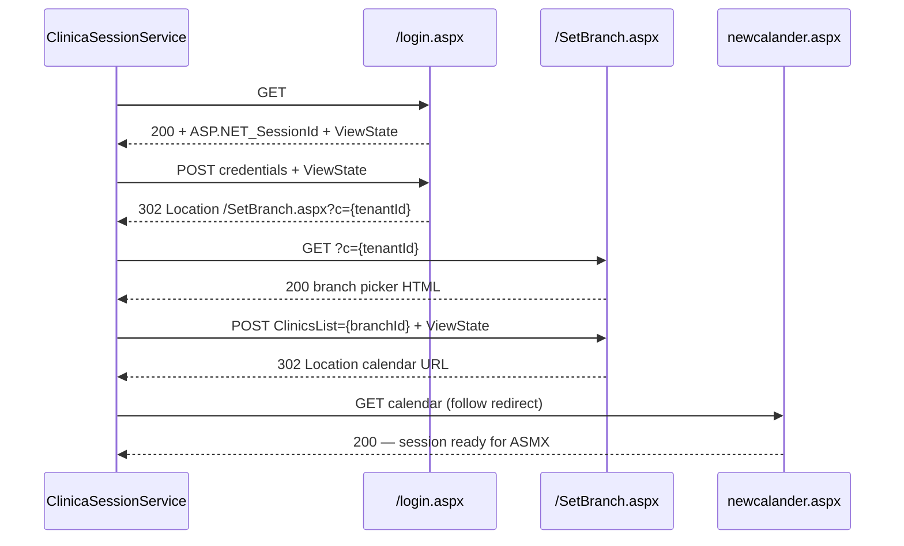
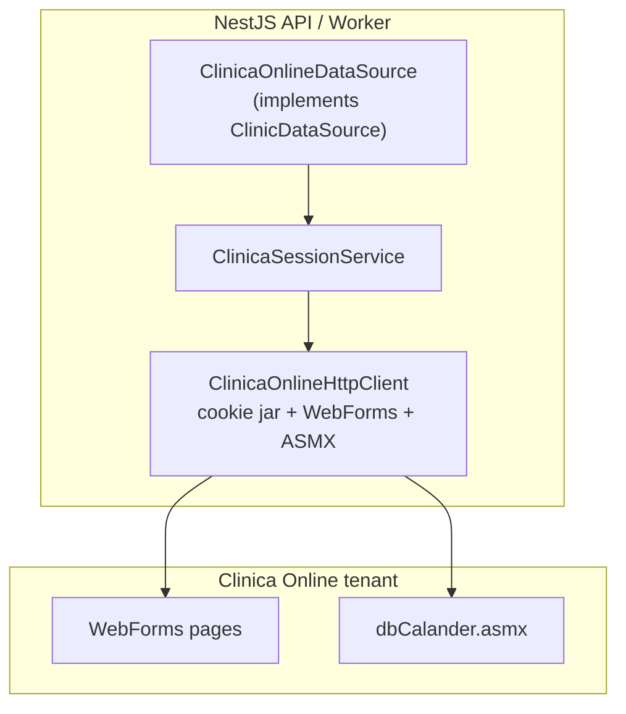
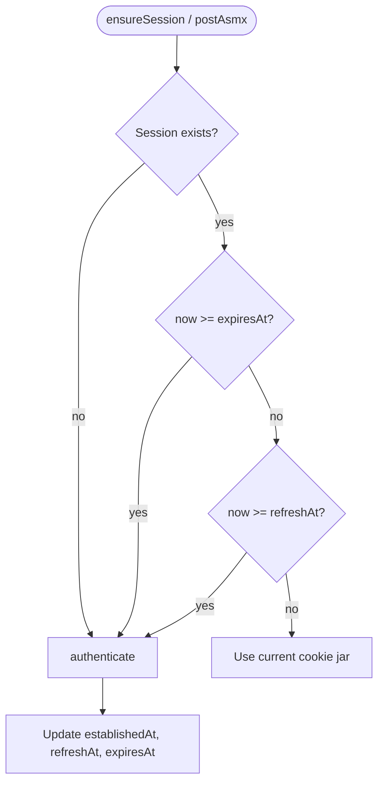
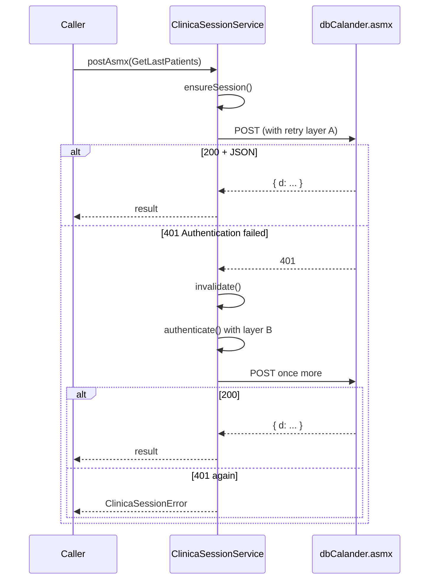
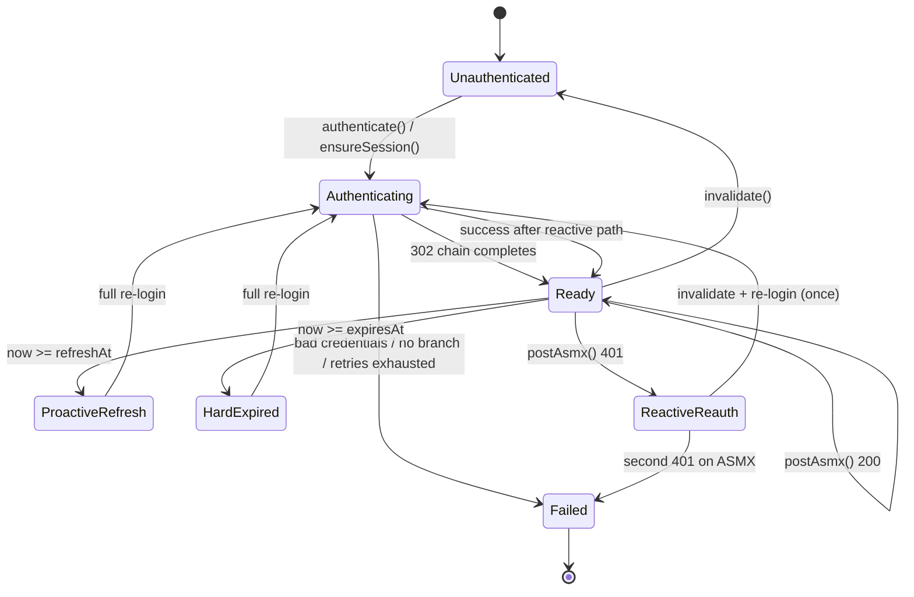

# V0 — Clinica Online login & session (external backend)

Project: [[clinic-reminder-system]]
Resolve interceptors: [[v0-reminder-resolve-interceptors]]
External resolve context: [[v0-external-resolve-before-reminder]]
Probe / HAR evidence: `examples/03-clinica-online-auth/` ([FINDINGS.md](../../examples/03-clinica-online-auth/FINDINGS.md))

**Status:** specification only — **probe code exists in `examples/`; no NestJS service yet.**

## Problem

`ClinicDataSource` must read owner/case/phone data from the clinic’s **existing third-party system** ([Clinica Online](https://clinicaonline.co.il)). That system has **no OAuth or public REST API** for integrations. Access is via:

1. **ASP.NET WebForms login** (username/password → session cookies)
2. **Branch selection** (multi-clinic accounts)
3. **Legacy ASMX JSON endpoints** (`/Restricted/dbCalander.asmx/{Method}`) authenticated by the same cookies

Before `resolveReminderContext()` or `GetLastPatients` can run, the backend needs a **durable authenticated session** against the tenant URL (e.g. `https://toran.clinicaonline.co.il`).

Today: standalone probe in `examples/03-clinica-online-auth/src/clinica-client.ts` proves the HTTP sequence. V0 needs a **NestJS injectable service** that wraps this for production use on Render.

## Auth flow type

| Layer | Mechanism |
|-------|-----------|
| **Primary** | ASP.NET **Forms Authentication** — POST credentials → HttpOnly ticket cookie (typically `.ASPXAUTH`) |
| **Session** | `ASP.NET_SessionId` + **ViewState** / **EventValidation** on every WebForms POST |
| **Scope** | **Branch selection** POST (`SetBranch.aspx`) binds the session to one clinic location |
| **Data API** | ASP.NET AJAX **ASMX** — JSON POSTs reuse cookies; not CORS-enabled |

**Integration constraint:** login and all data calls must run **server-side** with a cookie jar. Browser or cross-origin fetch from our API domain will not work.

## Goals (V0)

| Goal | Detail |
|------|--------|
| Authenticated session | Login + branch selection in one call path |
| Reuse for data calls | Same cookie jar for ASMX methods (`GetLastPatients`, later `GetUserPresList`, etc.) |
| Config-driven | Base URL, credentials, branch id from env / Render secrets |
| Swappable | Interface so tests use a mock; prod uses Clinica Online adapter |
| Fail clearly | Distinguish bad credentials, missing branch, session expiry, upstream unavailable |
| Resilient | HTTP retry with backoff; reactive re-login on 401; proactive refresh before estimated expiry |

## Non-goals (V0)

- Storing clinic credentials in Supabase
- User-facing login UI or OAuth
- Session sharing with the vet’s browser / Chrome extension (V3)
- Automatic branch discovery without config (branch id is configured per deployment)
- SMS quota / prefs ASMX calls from HAR 03 entries 4–5
- Token refresh via “remember me” (not used in HAR captures)

## External login sequence (evidence)

Derived from HAR captures `01-login.har` → `02-select-clinic-florentin.har`. See [FINDINGS.md](../../examples/03-clinica-online-auth/FINDINGS.md) for field-level detail.



### Crucial HTTP steps

| Step | Method | Path | Success signal |
|------|--------|------|----------------|
| 1 | GET | `/login.aspx` | `200`; parse `__VIEWSTATE`, `__EVENTVALIDATION`, `__VIEWSTATEGENERATOR` |
| 2 | POST | `/login.aspx` | `302`; `Location: /SetBranch.aspx?c=…` |
| 3 | GET | `/SetBranch.aspx?c={tenantId}` | `200`; parse branch `<select>` if validating config |
| 4 | POST | `/SetBranch.aspx?c={tenantId}` | `302`; `Location: /vetclinic/…/newcalander.aspx?…` |
| 5 | GET | calendar path from step 4 | `200` (establishes branch context) |

**ViewState rule:** every WebForms GET yields new hidden fields. **Never replay** stale POST bodies from HAR files.

### Branch id format (Toran tenant)

Configured value: `{clinicBranchId}_{tenantId}_0`, e.g. `41016_41002_0` = Florentin.

| `CLINICA_BRANCH_ID` | Label |
|---------------------|-------|
| `41027_41002_0` | פתח תקווה |
| `41015_41002_0` | תל אביב תורן |
| `41016_41002_0` | פלורנטין - תל אביב |
| `41018_41002_0` | וטרינר תורן - הוד השרון |

Tenant id (`41002`) comes from the login redirect query param `c=` — do not hardcode if multi-tenant deployments are added later.

## Service design (spec)

### Layering



| Component | Responsibility |
|-----------|----------------|
| `ClinicaOnlineHttpClient` | Low-level fetch, cookie jar, parse ViewState, POST form / JSON |
| `ClinicaSessionService` | Orchestrate login sequence; hold session; detect expiry; re-login |
| `ClinicaOnlineDataSource` | Uses session to call ASMX; maps responses to `ClinicReminderContext` |

Probe code [`clinica-client.ts`](../../examples/03-clinica-online-auth/src/clinica-client.ts) is the reference implementation to port into `src/clinic-online/` (path TBD).

### `ClinicaSessionService` interface (spec)

```typescript
export interface ClinicaSession {
  /** Cookie names present after successful login (for logging; not for export) */
  readonly cookieNames: readonly string[];
  /** Branch id committed in step 4 */
  readonly branchId: string;
  /** Tenant id from SetBranch redirect (e.g. 41002) */
  readonly tenantId: string;
  /** When this session was established (full login chain completed) */
  readonly establishedAt: Date;
  /** Proactive re-auth deadline — see Session refresh policy */
  readonly refreshAt: Date;
  /** Hard expiry estimate — session must not be used after this */
  readonly expiresAt: Date;
}

export interface ClinicaSessionService {
  /** Login + branch selection; replaces any prior session */
  authenticate(): Promise<ClinicaSession>;

  /** Return active session; re-auth if missing, past refreshAt, or past expiresAt */
  ensureSession(): Promise<ClinicaSession>;

  /** POST JSON to ASMX method; retries per Retry policy */
  postAsmx<T>(method: string, body: unknown, refererPath: string): Promise<T>;

  /** Drop cookies; next call re-authenticates */
  invalidate(): void;
}
```

### Configuration (spec)

| Env var | Required | Example | Notes |
|---------|----------|---------|-------|
| `CLINICA_BASE_URL` | yes | `https://toran.clinicaonline.co.il` | Per-clinic tenant URL |
| `CLINICA_USERNAME` | yes | — | Render secret |
| `CLINICA_PASSWORD` | yes | — | Render secret |
| `CLINICA_BRANCH_ID` | yes | `41016_41002_0` | From SetBranch dropdown |

Optional (implementation):

| Env var | Default | Purpose |
|---------|---------|---------|
| `CLINICA_SESSION_REFRESH_MS` | `900000` (15 min) | **Proactive** re-auth — refresh before this elapsed since `establishedAt` |
| `CLINICA_SESSION_MAX_AGE_MS` | `1200000` (20 min) | **Hard cap** — treat session as dead after this (ASP.NET session default) |
| `CLINICA_SESSION_REFRESH_SAFETY_MS` | `60000` (1 min) | `refreshAt` is at most `expiresAt - safety` |
| `CLINICA_FORMS_AUTH_MAX_AGE_MS` | `1800000` (30 min) | Upper bound if Forms Auth outlives session (see refresh policy) |
| `CLINICA_LOGIN_TIMEOUT_MS` | `30000` | Per HTTP request timeout |
| `CLINICA_RETRY_MAX_ATTEMPTS` | `3` | Max attempts for retriable HTTP / login steps |
| `CLINICA_RETRY_BASE_DELAY_MS` | `1000` | Initial backoff for retries (exponential + jitter) |

**Never** commit credentials or log cookie values.

## Session refresh policy (spec)

Clinica Online does not expose token TTL in an API. HAR captures have **empty cookie jars** — no `Set-Cookie` `Expires` / `Max-Age` to read at runtime. Refresh timing is therefore **estimated** from typical ASP.NET defaults and refined after production observation.

### Two cookies, two clocks

| Cookie | Typical server default | Role | V0 estimate |
|--------|------------------------|------|-------------|
| `ASP.NET_SessionId` | **20 minutes** idle (session state) | ViewState / server session | **Hard limit** — `expiresAt` |
| `.ASPXAUTH` (Forms Auth ticket) | **30 minutes** sliding (common `web.config`) | Authenticated user | **Soft upper bound** |

**V0 rule:** the integration session is only as good as the **shorter** effective lifetime. We assume **~20 minutes** max without activity unless `Set-Cookie` at login proves otherwise.

### Computed deadlines (on successful `authenticate()`)

```typescript
const establishedAt = new Date();

// Parse Set-Cookie Expires/Max-Age for .ASPXAUTH and ASP.NET_SessionId when present;
// take the earliest parsed instant, else fall back to estimates below.
const expiresAt = min(
  establishedAt + CLINICA_SESSION_MAX_AGE_MS,           // default 20 min
  parsedFormsAuthExpiry ?? establishedAt + CLINICA_FORMS_AUTH_MAX_AGE_MS,
);

const refreshAt = min(
  establishedAt + CLINICA_SESSION_REFRESH_MS,           // default 15 min
  expiresAt - CLINICA_SESSION_REFRESH_SAFETY_MS,        // default 60 s margin
);
```

| Deadline | Default offset | Meaning |
|----------|----------------|---------|
| `refreshAt` | **15 min** after login | `ensureSession()` triggers **proactive** full re-login (steps 1–5) |
| `expiresAt` | **20 min** after login | Session treated as invalid even if ASMX has not yet returned 401 |

**Safety margin:** proactive refresh fires **5 minutes before** assumed session expiry (15 min vs 20 min). Adjust via env if prod logs show earlier 401s.

### Refresh triggers (priority order)



| Trigger | Type | Action |
|---------|------|--------|
| No session / after `invalidate()` | — | Full `authenticate()` |
| `now >= expiresAt` | Proactive (hard) | Full `authenticate()` |
| `now >= refreshAt` | Proactive (soft) | Full `authenticate()` before next ASMX call |
| ASMX `401` / `Authentication failed` | Reactive | `invalidate()` → `authenticate()` → **one** retry of the ASMX call |
| Login POST returns Hebrew failure text | — | **No refresh** — throw `ClinicaAuthError` (bad credentials) |

**V0 does not** extend `refreshAt` on successful ASMX calls (no sliding window). Optional later: bump `refreshAt` on activity if prod shows sessions live longer when used.

### Calibrating estimates (post-deploy)

Log on each `authenticate()` and each ASMX `401`:

- `establishedAt`, `refreshAt`, `expiresAt`
- `sessionAgeMs` at time of 401
- whether `Set-Cookie` carried parseable expiry

If 401s cluster **before 15 min**, lower `CLINICA_SESSION_REFRESH_MS`. If sessions survive **>20 min**, raise `CLINICA_SESSION_MAX_AGE_MS` using measured data — do not guess above 30 min without evidence.

## Retry policy (spec)

Retries are **layered** by operation type. **Never retry** credential failures or unbounded re-login loops.

### Summary table

| Layer | Operation | Retriable errors | Max attempts | Backoff |
|-------|-----------|------------------|--------------|---------|
| **A** | Single HTTP fetch (GET/POST) | Network error, `408`, `429`, `502`, `503`, timeout | 3 | Exponential: `base * 2^attempt` + jitter 0–250 ms |
| **B** | Full login chain (`authenticate`) | Layer A failures on any of steps 1–5 | 3 | Same as A; **re-start chain from step 1** on retry |
| **C** | ASMX `postAsmx` | Layer A on HTTP; **plus** one auth recovery path | 3 HTTP + 1 auth | After auth recovery, **1** ASMX retry only |
| — | Login credential failure (`200` + Hebrew error) | — | **0** | Throw immediately |
| — | ASMX `401` after re-login | — | **0** | Throw `ClinicaSessionError` |
| — | ASMX `4xx` other than 401 | — | **0** | Throw (client/adapter bug) |

### Layer A — HTTP client

```typescript
async function withHttpRetry<T>(fn: () => Promise<T>): Promise<T> {
  for (let attempt = 0; attempt < CLINICA_RETRY_MAX_ATTEMPTS; attempt++) {
    try {
      return await fn();
    } catch (err) {
      if (!isRetriableHttpError(err) || attempt === CLINICA_RETRY_MAX_ATTEMPTS - 1) throw err;
      await sleep(backoffMs(attempt));
    }
  }
  throw new Error('unreachable');
}
```

**Retriable:** `ECONNRESET`, `ETIMEDOUT`, fetch abort (timeout), HTTP `408`, `429`, `502`, `503`.

**Not retriable:** `401`, `403`, `404`, `500` (application error body), login failure HTML.

### Layer B — Login chain

The five-step WebForms sequence is **atomic**: if step 4 fails after step 2 succeeded, discard the jar and retry the **entire** chain from step 1 (new ViewState).

**Concurrency:** only one `authenticate()` at a time per process — use an async mutex / `Promise` gate so parallel `ensureSession()` callers share one login, not N simultaneous logins against the clinic account.

### Layer C — ASMX with session recovery



**Max re-login cycles per `postAsmx` call:** **1**. No infinite 401 loops.

### Backoff formula

```
delayMs = CLINICA_RETRY_BASE_DELAY_MS * 2^attempt + random(0, 250)
```

Cap delay at **10 s** for V0. Example with defaults: ~1 s → ~2 s → ~4 s across three attempts.

### Logging (retry-related)

| Event | Log level | Fields |
|-------|-----------|--------|
| HTTP retry | `warn` | `attempt`, `path`, `status` or error code |
| Proactive session refresh | `info` | `sessionAgeMs`, `refreshAt` |
| Reactive re-login after 401 | `warn` | `method`, `sessionAgeMs` |
| Re-login failed (2nd 401) | `error` | `method`, `sessionAgeMs` |
| Auth failure (bad password) | `error` | no credentials in log |

## Session lifecycle (spec)



| Event | Action |
|-------|--------|
| First ASMX call | `ensureSession()` → login if no jar or past `refreshAt` / `expiresAt` |
| `now >= refreshAt` | Proactive full `authenticate()` before ASMX |
| `now >= expiresAt` | Same as proactive (hard floor) |
| ASMX `401` | `invalidate()` → `authenticate()` (layer B retries) → **one** ASMX retry |
| Second `401` after re-login | Throw `ClinicaSessionError` (no further retry) |
| Transient HTTP error on login step | Layer A/B retry with backoff |
| Wrong password on login | `200` + Hebrew failure text → throw `ClinicaAuthError` (no retry) |
| Missing `CLINICA_BRANCH_ID` on multi-branch account | Throw at config validation or after parsing branch list |

### WebForms POST body template (spec)

Login (`/login.aspx`):

```
__LASTFOCUS, __EVENTTARGET, __EVENTARGUMENT  (empty)
__VIEWSTATE, __VIEWSTATEGENERATOR, __VIEWSTATEENCRYPTED, __EVENTVALIDATION, __sc
ctl00$MainContent$Login1$UserName
ctl00$MainContent$Login1$Password
ctl00$MainContent$Login1$LoginButton=כניסה
ctl00$IsMobile=false
```

Branch (`/SetBranch.aspx?c={tenantId}`):

```
(same hidden fields from branch page GET)
ctl00$MainContent$ClinicsList={branchId}
ctl00$MainContent$Button1=שלח
ctl00$IsMobile=false
```

Headers: `Content-Type: application/x-www-form-urlencoded`, `Origin: {baseUrl}`, `Referer: {page url}`, `Cookie: {jar}`.

### ASMX call template (spec)

After session is ready (see HAR `03-get-last-patients.har`):

```
POST /Restricted/dbCalander.asmx/GetLastPatients
Content-Type: application/json; charset=UTF-8
X-Requested-With: XMLHttpRequest
Referer: {baseUrl}/vetclinic/therapists/patientlistvet.aspx
Cookie: {jar}

{"move":0,"fromDate":""}
```

Response: `{ "d": T }`. Unauthenticated: `401` with `{"Message":"Authentication failed."}`.

## Error contract (spec)

| Condition | Exception / HTTP | Message (example) |
|-----------|------------------|-------------------|
| Missing env config | `500` at startup or first use | `Clinica Online credentials not configured` |
| Invalid username/password | `ClinicaAuthError` → `502` when called from resolver | `Clinica Online login failed` |
| Configured branch not in picker | `ClinicaAuthError` | `CLINICA_BRANCH_ID not available for this account` |
| No redirect after login POST | `ClinicaAuthError` | `Unexpected login response` |
| ASMX 401 after re-login | `ClinicaSessionError` → `502` | `Clinica Online session expired` |
| Login retries exhausted | `ClinicaUnavailableError` → `503` | `Clinica Online login failed after retries` |
| Network / timeout (after retries) | `ClinicaUnavailableError` → `503` | `Clinica Online unavailable` |
| Non-JSON ASMX response | `ClinicaUnavailableError` | `Invalid response from Clinica Online` |

When used from [[v0-reminder-resolve-interceptors]], map adapter failures to **`502`/`503`** on `POST /reminders` — same as other `ClinicDataSource` errors.

## Relation to `ClinicDataSource`

Today:

```typescript
interface ClinicDataSource {
  listReminderCandidates(): Promise<ReminderCandidate[]>;
}
```

Target (from [[v0-reminder-resolve-interceptors]]):

```typescript
interface ClinicDataSource {
  listReminderCandidates(): Promise<ReminderCandidate[]>;
  resolveReminderContext(input: { externalCaseId: string; externalOwnerId: string }): Promise<ClinicReminderContext | null>;
}
```

**Login is a prerequisite**, not part of the public API:

1. `ClinicaOnlineDataSource.resolveReminderContext()` calls `sessionService.ensureSession()`.
2. Session service performs steps 1–5 once (or reuses cached jar).
3. Data source calls ASMX (e.g. lookup by `UserID` / `recordID` from external ids).

V0 proof path already demonstrated: `GetLastPatients` after login ([`03-get-last-patients.har`](../../examples/03-clinica-online-auth/03-get-last-patients.har)).

## NestJS module sketch (spec)

```
src/clinic-online/
  clinic-online.module.ts
  clinica-session.service.ts
  clinica-online-http.client.ts
  clinica-online-data-source.ts      # implements ClinicDataSource
  clinica-online.config.ts           # env validation
  errors/
    clinica-auth.error.ts
    clinica-session.error.ts
    clinica-unavailable.error.ts
  types/
    clinica-session.interface.ts
    reg-personal.types.ts            # ASMX DTOs
```

Register `ClinicaOnlineDataSource` as `CLINIC_DATA_SOURCE` when `CLINICA_BASE_URL` is set; otherwise keep `MockClinicDataSource` for local dev without secrets.

## Testing strategy (when implemented)

| Layer | What to test |
|-------|----------------|
| Unit | ViewState parser; cookie jar merge; login failure detection (Hebrew string) |
| Unit | Retry backoff; retriable vs non-retriable error classification |
| Unit | `refreshAt` / `expiresAt` computation; proactive refresh when `now >= refreshAt` |
| Unit | ASMX 401 → single re-login → one retry; second 401 throws |
| Unit | Concurrent `ensureSession()` shares one in-flight `authenticate()` |
| Integration | `examples/03-clinica-online-auth` script against real tenant (manual / CI secret) |
| E2E | Mock HTTP server replaying HAR responses → `ensureSession` + `GetLastPatients` |
| E2E | `ClinicaOnlineDataSource` 502 when login returns failure page |

Keep HAR files as fixtures for mock server responses; **strip credentials** from any committed JSON.

## Security

| Rule | Detail |
|------|--------|
| Secrets | `CLINICA_USERNAME` / `CLINICA_PASSWORD` only in Render env / local `.env` |
| Logging | Log step outcomes and cookie **names**, never values |
| Scope | One service account per deployment; branch fixed by config |
| Transport | HTTPS only (`CLINICA_BASE_URL` must be `https://`) |
| Rate | Serialize login attempts (mutex); backoff on 503 (no hammering WebForms) |

## Implementation order (suggested)

1. Port `ClinicaOnlineHttpClient` from `examples/03-clinica-online-auth/src/clinica-client.ts` into `src/clinic-online/`.
2. Implement `ClinicaSessionService` with retry helper, refresh deadlines, and authenticate mutex.
3. Wire config module + env validation.
4. Add `getLastPatients()` on data source as first ASMX consumer (validates session end-to-end).
5. Extend data source with `resolveReminderContext()` mapping (separate task / spec).
6. Switch `CLINIC_DATA_SOURCE` provider when Clinica env is present.

## Open questions

| # | Question |
|---|----------|
| 1 | ~~Session TTL~~ — **V0 defaults: refresh at 15 min, hard cap 20 min**; calibrate from prod 401 logs and `Set-Cookie` parsing. |
| 2 | Is `GET patientlistvet.aspx` required before every ASMX call or only once per session? (HAR suggests referer matters; probe with minimal calls.) |
| 3 | Single worker-wide session vs per-request login at low volume? (V0: **one cached session** in API process; revisit if horizontal scale.) |
| 4 | Map `externalOwnerId` to Clinica `UserID` (GUID) vs `recordID` (int)? |
| 5 | Multiple branches in one deployment — one env per branch or runtime branch param? (V0: **one branch per deployment**.) |

## Related files

| Path | Relevance |
|------|-----------|
| `examples/03-clinica-online-auth/` | HAR captures, FINDINGS, working probe |
| `examples/03-clinica-online-auth/src/clinica-client.ts` | Reference login + `GetLastPatients` |
| `src/clinic-data-source/` | `ClinicDataSource` interface + mock |
| [[v0-reminder-resolve-interceptors]] | Consumer of authenticated data source |
| [[v0-external-resolve-before-reminder]] | Why external resolve needs this |
