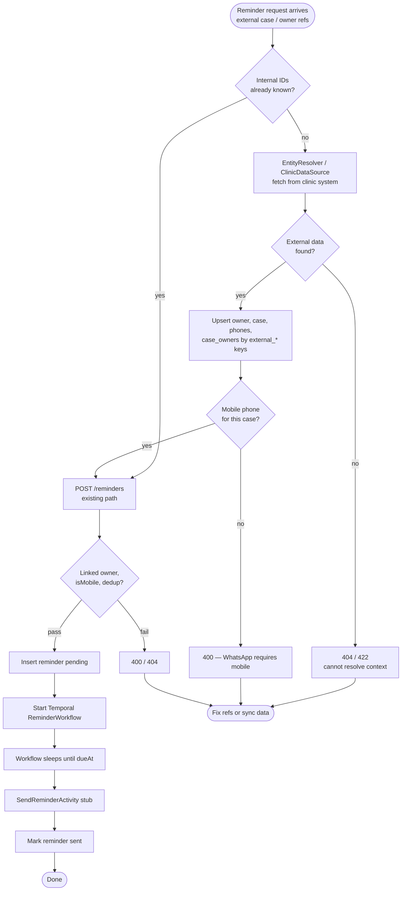
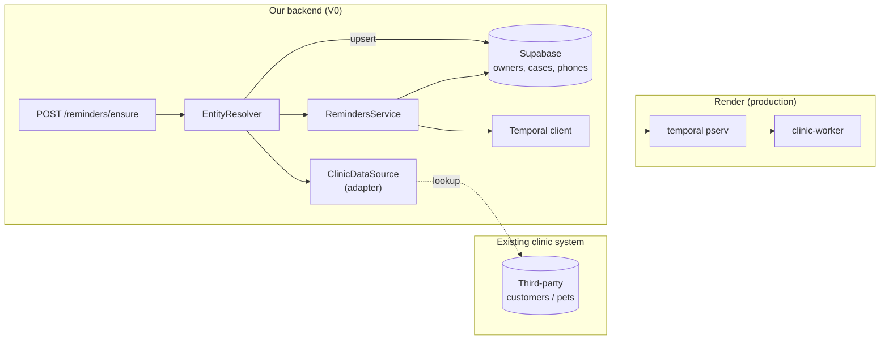

# V0 — Resolve owner/case from external clinic system before reminder

Project: [[clinic-reminder-system]]
User flows (today): [[clinic-reminder-system-user-flows]]
Specification: [[clinic-reminder-system-specification]]
Architecture: [[clinic-reminder-system-architecture]]

## Problem

A request may arrive as **“create a reminder”** without the assistant (or an upstream integration) already knowing our internal `ownerId`, `caseId`, and `phoneNumberId`.

Today `POST /reminders` requires all three UUIDs plus validation that:

- the owner exists and is linked to the case;
- the phone belongs to that owner;
- the phone is an Israeli **mobile** (`isMobile: true`).

If the pet/owner live only in the **existing third-party clinic system**, someone must **gather or sync** that data into our Supabase app DB before the reminder path can run. V0 has no automated bridge — `ClinicDataSource` is a mock returning an empty list.

This is a **V0-shaped** problem: we need a clear resolution step without building full Chrome-extension ingestion (V3) or WhatsApp (V2).

## What we have today

| Piece | Role | Gap |
|---|---|---|
| `POST /owners`, `/cases`, `/phone-numbers`, link endpoints | Manual materialization | Caller must orchestrate many steps |
| `POST /reminders` | Schedule after IDs exist | No external keys, no “ensure” semantics |
| `ClinicDataSource` | Swappable ingestion | `listReminderCandidates()` only; no lookup by external id |
| App DB schema | Internal UUID primary keys | No `external_*` mapping columns yet |

Production flows we verified assume entities already exist locally (or are created in the same session).

## Desired outcome (V0)

Given a **reminder intent** that references the clinic system (e.g. external customer id + pet id + due date + message), the system should:

1. **Resolve** owner, case, phones, and case↔owner link in our DB (fetch from external source or read cache).
2. **Pick** the correct mobile `phoneNumberId` for that case (V0: explicit or first mobile; later: primary/secondary on case).
3. **Create** the reminder and start Temporal — same as today.

Idempotency matters: repeated “remind Luna’s vaccination” should not spawn duplicate owners/cases if we already synced them.

## Approach options

### A — Caller orchestrates (status quo, documented)

The assistant or integration calls our CRUD API in order after **it** fetched data from the clinic system.

| Pros | Cons |
|---|---|
| No backend change | Duplicated logic in every client |
| Matches current production tests | Easy to get link/phone wrong |
| Good for manual ops | No single “create reminder” contract |

**When:** manual assistant workflow, one-off scripts.

---

### B — `POST /reminders/ensure` (or expanded body) on NestJS **(recommended V0)**

One endpoint accepts **external references** + reminder fields. Server runs an **`EntityResolver`**:

1. `ClinicDataSource.lookupCase(externalCaseId)` / `lookupOwner(externalOwnerId)` (or one `lookupReminderContext`).
2. Upsert `owners`, `cases`, `phone_numbers`, `case_owners` (match on `external_*` unique columns).
3. Delegate to existing `RemindersService.create()` with internal IDs.

| Pros | Cons |
|---|---|
| Single API for integrations | Need schema migration for external ids |
| Validation stays centralized | Must define external API adapter |
| Reuses Temporal path unchanged | Resolver errors need clear 4xx/502 |

**When:** default for V0+1 — backend owns consistency.

---

### C — Expand `ClinicDataSource` + background sync

`ClinicDataSource` gains `fetchOwner`, `fetchCase`, `fetchPhones`. A cron or manual `POST /sync/clinic` pulls batches; reminders always use **internal** ids.

| Pros | Cons |
|---|---|
| Clean separation: sync vs schedule | Stale data until next sync |
| Good for batch “who is due this week” | Two-step mental model |
| Fits future Chrome extension | More moving parts for V0 |

**When:** clinic system is slow or rate-limited; reminders created from pre-synced snapshot.

---

### D — Temporal “resolve then remind” workflow

Long-running workflow: activity calls external system, upserts DB, then child `ReminderWorkflow`.

| Pros | Cons |
|---|---|
| Retries/durability for flaky external API | Heavy for V0 volume |
| Visible in Temporal UI | Overkill before real integration exists |

**When:** external API is unreliable or multi-step; defer until B is insufficient.

---

### E — Mapping table only (no live fetch)

Store `external_owner_id` / `external_case_id` on our rows; **manual or script** fills them once; `POST /reminders` accepts optional external ids and resolves locally without calling clinic system.

| Pros | Cons |
|---|---|
| Simple schema + lookup | Data drifts if clinic system changes |
| No runtime dependency on third party | Still need initial import path |

**When:** bridge until B/C have a real adapter.

## Recommended V0 path

**Chosen direction:** NestJS **interceptors** on `POST /reminders` — see [[v0-reminder-resolve-interceptors]] (spec only, no code yet).

Earlier option B (`POST /reminders/ensure` + `EntityResolver`) is superseded for V0 by the interceptor pipeline; same upsert and `ClinicDataSource` ideas apply.

**B + E together (still applies):**

1. Migration: optional unique `external_owner_id`, `external_case_id` (and later `external_phone` or source tag on phones).
2. `ClinicDataSource` interface: add `resolveReminderContext(input)` returning normalized owner, case, phones, preferred mobile.
3. Implement `MockClinicDataSource` + one real adapter stub (JSON file or HTTP config) for dev.
4. Interceptors on `POST /reminders` call resolver → upsert → body rewrite → `RemindersService.create` (see [[v0-reminder-resolve-interceptors]]).
5. Keep existing granular endpoints for manual assistant and tests.

Defer C/D until we know how the clinic system is accessed (extension session vs API vs export).

## Primary flow — external intent to scheduled reminder (target)

## Component sketch (approach B)

## Open questions (next session)

| # | Question |
|---|---|
| 1 | What identifier does the clinic system expose? (customer id, animal id, appointment id?) |
| 2 | Can we read it via API, export, or only through a browser session (extension)? |
| 3 | Who picks primary mobile when an owner has several — assistant, rules, or stored per case? |
| 4 | Should `POST /reminders/ensure` be idempotent on `(externalCaseId, reminderType, dueAt window)`? |
| 5 | Do we resolve synchronously in the HTTP request or return 202 + poll? (V0: sync is fine at low volume) |

## Out of scope for this draft

- Chrome extension implementation (V3).
- Real WhatsApp send (V2).
- Cross-case duplicate deduplication (documented in user flows, not built).
- Case-level primary/secondary phone columns (target model, not V0 schema).

## Related files

| Path | Relevance |
|---|---|
| `src/clinic-data-source/` | Extend interface + adapters |
| `src/reminders/reminders.service.ts` | Unchanged create path after resolve |
| `src/db/schema.ts` | Add `external_*` columns when approach B/E is chosen |
| [[clinic-reminder-system-user-flows]] | Manual flow today; compare to target diagram above |
