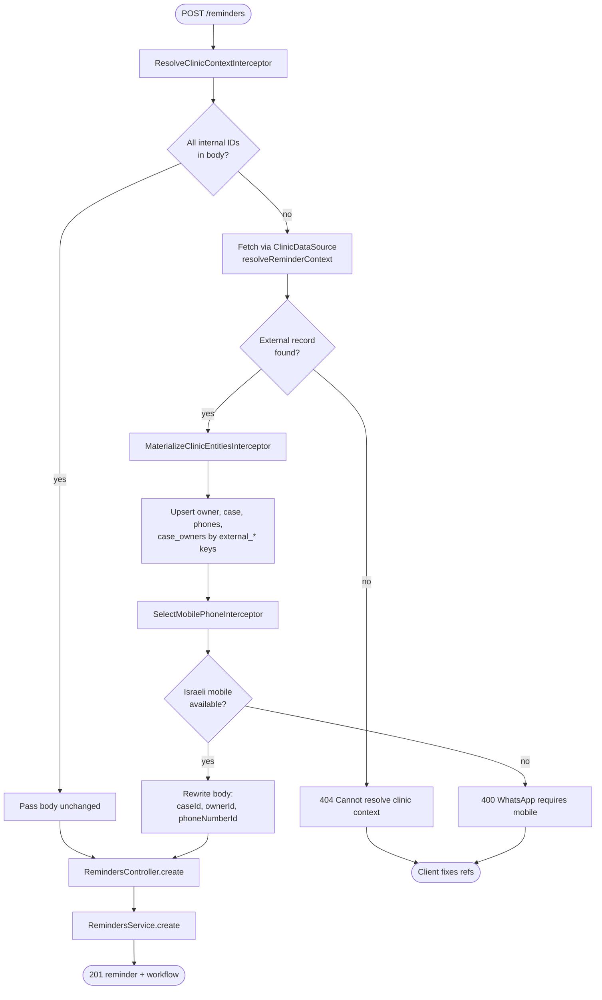
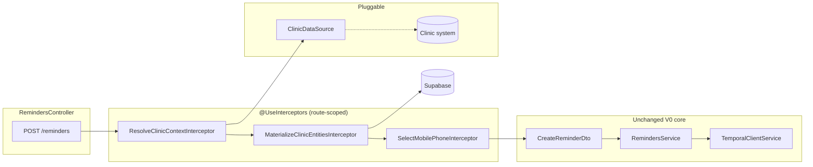

# V0 — NestJS interceptors: resolve clinic context before reminder

Project: [[clinic-reminder-system]]
Problem context: [[v0-external-resolve-before-reminder]]
User flows (today): [[clinic-reminder-system-user-flows]]
Architecture: [[clinic-reminder-system-architecture]]

**Status:** specification only — **no implementation in V0 yet.**

## Decision (V0)

When `POST /reminders` arrives without internal UUIDs, **NestJS interceptors** on the reminders route resolve owner, case, phone, and case↔owner link from the external clinic system (via `ClinicDataSource`), materialize rows in Supabase, then **rewrite the request body** so `RemindersController` / `RemindersService` keep today’s contract unchanged.

This is the chosen V0 direction over a separate `POST /reminders/ensure` handler (see [[v0-external-resolve-before-reminder]] approach B vs interceptor variant below).

## Goals

| Goal | Detail |
|---|---|
| Single entrypoint | Callers still hit `POST /reminders` |
| Thin controller | No resolution logic in `RemindersController` |
| Swappable external access | Resolution delegates to `ClinicDataSource` adapter |
| Unchanged core | `RemindersService.create()` still receives internal `caseId`, `ownerId`, `phoneNumberId` |
| V0 scope | Spec + interfaces only; mock adapter; no Chrome extension |

## Non-goals (V0)

- Implementing interceptors, DTOs, migrations, or `ClinicDataSource` lookup methods
- Temporal changes
- Real clinic-system HTTP client
- Case-level primary/secondary phone on schema
- Cross-case deduplication

## Request shapes

### Today (internal IDs only)

```json
{
  "caseId": "uuid",
  "ownerId": "uuid",
  "phoneNumberId": "uuid",
  "reminderType": "vaccination",
  "message": "...",
  "dueAt": "2026-07-01T09:00:00.000Z"
}
```

Interceptor **passes through** — no external fields present.

### Target (external refs — interceptor resolves)

```json
{
  "externalCaseId": "clinic-pet-12345",
  "externalOwnerId": "clinic-customer-67890",
  "reminderType": "vaccination",
  "message": "...",
  "dueAt": "2026-07-01T09:00:00.000Z"
}
```

Optional V0 fields (TBD at implementation):

| Field | Purpose |
|---|---|
| `externalPhone` | Force a specific line when owner has multiple mobiles |
| `phoneNumberId` | Mixed mode: external case/owner + known internal phone |

**Rule:** if all three internal IDs are present and valid, interceptors **do not** call the clinic system.

**Rule:** if any internal ID is missing, external refs are **required**; partial internal + partial external is **400** in V0.

## Interceptor pipeline

Applied with `@UseInterceptors(...)` on `RemindersController.create` only (not global).



### Interceptor responsibilities

| Interceptor | Responsibility | Depends on |
|---|---|---|
| `ResolveClinicContextInterceptor` | Detect mode (internal vs external); call `ClinicDataSource.resolveReminderContext()`; attach result to request context | `ClinicDataSource` |
| `MaterializeClinicEntitiesInterceptor` | Idempotent upsert into app DB; set internal UUIDs on context | Drizzle / entity services |
| `SelectMobilePhoneInterceptor` | Choose `phoneNumberId` (explicit `externalPhone` → normalize → match; else first `isMobile` on owner); rewrite `CreateReminderDto` body | Israeli phone util |

**V0 note:** three interceptors may be collapsed into one class for simplicity at implementation time; the spec keeps them separate for clarity.

## NestJS integration (spec)



### Request context (spec)

Interceptors share a typed bag on the request (name TBD), e.g. `ClinicResolveContext`:

| Field | Set by | Consumed by |
|---|---|---|
| `mode` | `'internal' \| 'external'` | logging / tests |
| `externalCaseId`, `externalOwnerId` | parse body | resolver |
| `resolved` | `ClinicDataSource` | materialize |
| `internalCaseId`, `internalOwnerId`, `internalPhoneNumberId` | materialize + select mobile | body rewrite |

Use `nestjs` `ExecutionContext.switchToHttp().getRequest()` — **do not** store resolution state on global singletons.

### DTO / validation (spec)

- `CreateReminderDto` stays the **post-interceptor** shape for `RemindersService` (internal IDs required).
- Introduce `CreateReminderRequestDto` (or union) for the **wire** shape: internal IDs **xor** external refs + shared reminder fields.
- `ValidationPipe` runs **before** interceptors on the wire DTO; interceptors produce a valid `CreateReminderDto` for the handler parameter.

Order: **ValidationPipe → Interceptors → Controller**.

## ClinicDataSource extension (spec)

Today:

```typescript
interface ClinicDataSource {
  listReminderCandidates(): Promise<ReminderCandidate[]>;
}
```

Add for interceptor path:

```typescript
interface ClinicDataSource {
  listReminderCandidates(): Promise<ReminderCandidate[]>;

  resolveReminderContext(input: {
    externalCaseId: string;
    externalOwnerId: string;
  }): Promise<ClinicReminderContext | null>;
}
```

`ClinicReminderContext` (spec shape):

| Field | Type | Notes |
|---|---|---|
| `externalCaseId` | string | echo / upsert key |
| `externalOwnerId` | string | echo / upsert key |
| `petName` | string | case row |
| `ownerName` | string | owner row |
| `phones` | array | `{ raw, isMobile }` from clinic system |
| `linkedOwnerIds` | string[] | V0: single owner; later co-owners |

`MockClinicDataSource` returns `null` or a fixed fixture for local dev.

## Schema extension (spec)

Materialize step requires stable external keys (see [[v0-external-resolve-before-reminder]] approach E):

| Table | Column | Constraint |
|---|---|---|
| `owners` | `external_owner_id` | unique, nullable |
| `cases` | `external_case_id` | unique, nullable |

Phones: upsert by `normalized_phone` (existing unique index). V0 does not add `external_phone_id` unless clinic system exposes stable phone ids.

## Error contract (spec)

| Condition | HTTP | Body |
|---|---|---|
| External refs missing when internal IDs incomplete | 400 | validation message |
| Clinic system has no matching record | 404 | `Cannot resolve clinic context for externalCaseId=…` |
| Resolved owner has no mobile | 400 | same copy as today’s non-mobile rule |
| ClinicDataSource timeout / adapter failure | 502 or 503 | `Clinic system unavailable` (exact code TBD) |
| Upsert race / DB error | 500 | generic |

Interceptors throw `NotFoundException` / `BadRequestException` / `ServiceUnavailableException` — **do not** call `RemindersService` on failure.

## Idempotency (spec)

| Operation | Key |
|---|---|
| Owner upsert | `external_owner_id` |
| Case upsert | `external_case_id` |
| Phone upsert | `normalized_phone` per owner |
| Case↔owner link | `(case_id, owner_id)` |
| Reminder dedup | unchanged V1 plan: phone + type + time window |

Repeated `POST /reminders` with same external refs should reuse internal UUIDs, not duplicate owners/cases.

## Testing strategy (when implemented)

| Layer | What to test |
|---|---|
| Unit | Each interceptor with mocked `ClinicDataSource` and DB |
| E2E | `POST /reminders` with external body → 201 + rows in DB |
| E2E | Internal body still works (interceptor no-op) |
| E2E | 404 when mock returns null |

No tests in this commit.

## Relation to other approaches

| Approach | This spec |
|---|---|
| Separate `/reminders/ensure` route | Avoided — interceptors keep one route |
| Caller orchestrates CRUD | Still valid for manual assistant; interceptors for integrated callers |
| Temporal resolve activity | Deferred |

## Open questions

1. Exact external id field names on the wire (`externalCaseId` vs `clinicCaseId`)?
2. Allow `externalCaseId` only and infer owner from clinic payload?
3. Single interceptor class vs three — team preference at implementation?
4. 502 vs 424 when clinic adapter fails?

## Related implementation paths (future)

| Path | Purpose |
|---|---|
| `src/reminders/interceptors/` | Interceptor classes |
| `src/clinic-data-source/` | `resolveReminderContext` |
| `src/reminders/dto/create-reminder-request.dto.ts` | Wire DTO |
| `drizzle/` migration | `external_*` columns |
