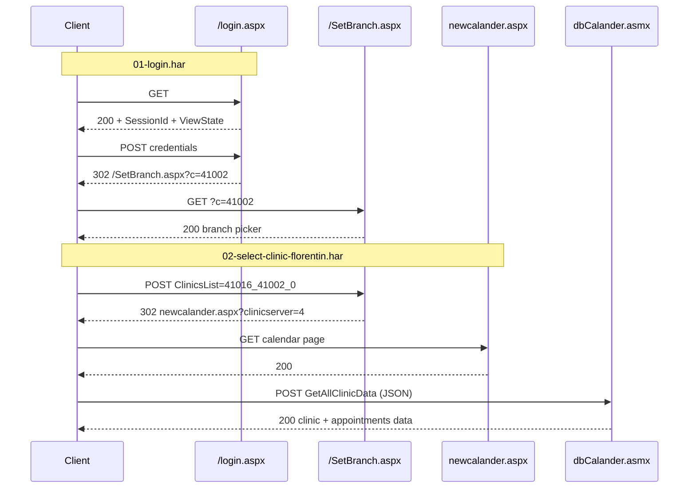

# ClinicaOnline auth probe — findings log

Clinic tenant: **Toran** (`c=41002`)  
Base URL: https://toran.clinicaonline.co.il  
Login: https://toran.clinicaonline.co.il/login.aspx  
Product: ClinicaOnline — ASP.NET WebForms 4.x on IIS 10

Source HAR captures (sequential, **local only — `*.har` is gitignored**):

| File | Step | Entries |
|------|------|---------|
| [`01-login.har`](./01-login.har) | Credential login → branch picker | 65 |
| [`02-select-clinic-florentin.har`](./02-select-clinic-florentin.har) | Select Florentin branch → calendar | 60 |
| [`03-get-last-patients.har`](./03-get-last-patients.har) | Last 20 changed patients (Florentin) | 8 |
| [`04-load-clinic-reminders.har`](./04-load-clinic-reminders.har) | Daily clinic reminder list (`LoadClinicReminders`) | 3 |
| [`updatedLatestFlow.har`](./updatedLatestFlow.har) | Patient list → chart → pets / vaccine window | 158 |
| [`searchByCustomerNumber.har`](./searchByCustomerNumber.har) | `SearchByCustNumber` probe | 1 |
| `searchByCustomerNumberRealData.har` *(local, gitignored)* | `SearchByCustNumber` hit (e.g. cust `90001`) | 95 |

**ASMX summary (pet, message, follow-up vs vaccination):** [API-MAP.md](./API-MAP.md)

---

## HAR 01 — login (`01-login.har`)

| # | Method | Path | Status | Crucial? |
|---|--------|------|--------|----------|
| 0 | GET | `/login.aspx` | 200 | **Yes** — session + ViewState |
| 1–33 | GET | CSS, JS, images, `WebResource.axd`, … | 200 | No — page assets |
| 16 | GET | `/Restricted/dbCalander.asmx/js` | 401 | Diagnostic only (pre-auth) |
| **34** | **POST** | **`/login.aspx`** | **302** | **Yes** — credential exchange |
| **35** | **GET** | **`/SetBranch.aspx?c=41002`** | **200** | **Yes** — branch picker HTML |
| 36–49 | GET | Same assets again on SetBranch page | 200 | No |
| 50 | GET | `/Restricted/dbCalander.asmx/js` | 200 | Partial — JS proxy loads, branch not committed |
| 51–64 | GET | Images on SetBranch | 200 | No |

## HAR 02 — select clinic (`02-select-clinic-florentin.har`)

Continues immediately after HAR 01 (user picks **פלורנטין - תל אביב**).

| # | Method | Path | Status | Crucial? |
|---|--------|------|--------|----------|
| **0** | **POST** | **`/SetBranch.aspx?c=41002`** | **302** | **Yes** — commit branch selection |
| **1** | **GET** | **`/vetclinic/managersa/newcalander.aspx?clinicserver=4`** | **200** | **Yes** — calendar app shell |
| 2–42 | GET | CSS, JS, images | 200 | No |
| 21 | GET | `/Restricted/dbCalander.asmx/js` | 200 | Loaded by calendar page |
| **43** | **POST** | **`/Restricted/dbCalander.asmx/GetNumBranchesForClinic`** | **200** | Data — branch list JSON |
| **51–55** | **POST** | **`/Restricted/dbCalander.asmx/{LoadClinicTreatments,GetAllClinicData,…}`** | **200** | Data — calendar bootstrap |
| 44–59 | GET | Images | 200 | No |

**Full programmatic flow needs 5 crucial calls** (plus optional ASMX data POSTs):

1. `GET /login.aspx`
2. `POST /login.aspx` → `302`
3. `GET /SetBranch.aspx?c=41002`
4. `POST /SetBranch.aspx?c=41002` → `302`
5. `GET /vetclinic/managersa/newcalander.aspx?clinicserver=4`

### HAR limitation

All `cookies` arrays in the HAR are **empty** — the exporter did not record `Cookie` / `Set-Cookie`. Replay must use a **cookie jar** in code and capture auth cookies from live responses (typically `ASP.NET_SessionId` + Forms Auth ticket, e.g. `.ASPXAUTH`).

### Context before login (entry 0)

`Referer: …/vetclinic/managersA/newcalander.aspx` — user was redirected to login from the **manager calendar** page after session expiry.

---

## Crucial flow (HAR 01 + 02)



---

## Step 1 — GET `/login.aspx`

**Purpose:** Obtain ephemeral WebForms state and session id.

**Response headers (typical):**

- `Set-Cookie: ASP.NET_SessionId=…; path=/; HttpOnly; SameSite=Lax`

**Parse from HTML:**

| Field | Required on POST |
|-------|------------------|
| `__VIEWSTATE` | Yes (~988–1072 chars) |
| `__VIEWSTATEGENERATOR` | Yes (`C2EE9ABB`) |
| `__VIEWSTATEENCRYPTED` | Yes (empty) |
| `__EVENTVALIDATION` | Yes (~284 chars) |
| `__sc` | Yes (empty) |

**Form:** `method="post" action="./login.aspx"`

---

## Step 2 — POST `/login.aspx`

**Purpose:** Submit credentials; server validates and issues auth cookies.

**Request headers (from HAR):**

- `Content-Type: application/x-www-form-urlencoded`
- `Origin: https://toran.clinicaonline.co.il`
- `Referer: https://toran.clinicaonline.co.il/login.aspx`
- `Cookie: ASP.NET_SessionId=…` (from step 1)

**POST body fields (HAR entry 34):**

| Field | Value in HAR |
|-------|----------------|
| `__LASTFOCUS` | *(empty)* |
| `__EVENTTARGET` | *(empty)* |
| `__EVENTARGUMENT` | *(empty)* |
| `__VIEWSTATE` | from step 1 |
| `__VIEWSTATEGENERATOR` | from step 1 |
| `__VIEWSTATEENCRYPTED` | *(empty)* |
| `__EVENTVALIDATION` | from step 1 |
| `__sc` | *(empty)* |
| `ctl00$MainContent$Login1$UserName` | *(credentials — not in repo)* |
| `ctl00$MainContent$Login1$Password` | *(credentials — not in repo)* |
| `ctl00$MainContent$Login1$LoginButton` | `כניסה` |
| `ctl00$IsMobile` | `false` |

Note: `RememberMe` was **not** checked in the HAR.

**Success response:**

- `302 Found`
- `Location: /SetBranch.aspx?c=41002`
- Sets Forms Auth cookie(s) — not visible in HAR; must capture at runtime

**Failure response:**

- `200` with Hebrew: `נסיון הכניסה למערכת נכשל. שם משתמש או סיסמא שגויים.`

**Without valid ViewState:** `302` to `/error.aspx` (generic error).

---

## Step 3 — GET `/SetBranch.aspx?c=41002`

**Purpose:** Multi-branch account gate. `c=41002` is the **Toran tenant id** (embedded in every branch option value).

**Page content (HAR entry 35):**

- Greeting: `שלום לך …` (Hello, {username})
- Prompt: user belongs to multiple branches — pick one
- `<select name="ctl00$MainContent$ClinicsList">` options:

| Value | Label |
|-------|-------|
| `41027_41002_0` | פתח תקווה |
| `41015_41002_0` | תל אביב תורן |
| `41016_41002_0` | פלורנטין - תל אביב |
| `41018_41002_0` | וטרינר תורן - הוד השרון |

- Submit: `ctl00$MainContent$Button1` = `שלח`

**ViewState on SetBranch** uses a different generator than login: `__VIEWSTATEGENERATOR=24FB0B02` (HAR 02 entry 0).

---

## Step 4 — POST `/SetBranch.aspx?c=41002` (HAR 02 entry 0)

**Purpose:** Commit selected clinic/branch. **Required** before calendar data works.

**POST body (Florentin selection):**

| Field | Value in HAR 02 |
|-------|-----------------|
| `__EVENTTARGET` | *(empty)* |
| `__EVENTARGUMENT` | *(empty)* |
| `__VIEWSTATE` | from step 3 GET (~1392 chars) |
| `__VIEWSTATEGENERATOR` | `24FB0B02` |
| `__EVENTVALIDATION` | from step 3 GET |
| `__sc` | *(empty)* |
| `ctl00$MainContent$ClinicsList` | **`41016_41002_0`** (Florentin) |
| `ctl00$MainContent$Button1` | `שלח` |
| `ctl00$IsMobile` | `false` |

**Success response:**

- `302 Found`
- `Location: /vetclinic/managersa/newcalander.aspx?clinicserver=4`

Set `CLINICA_BRANCH_ID=41016_41002_0` for Florentin (see branch table in step 3 for others).

---

## Step 5 — GET `/vetclinic/managersa/newcalander.aspx?clinicserver=4` (HAR 02 entry 1)

**Purpose:** Load manager calendar — confirms branch session is active.

**Note:** `clinicserver=4` appears constant for this tenant in the capture; may be per-deployment — follow the `Location` header from step 4 rather than hardcoding if it differs.

---

## Step 6 — ASMX data calls (HAR 02 entries 43–55)

After calendar load, the page POSTs JSON to method-specific URLs:

```
POST /Restricted/dbCalander.asmx/GetAllClinicData
Content-Type: application/json; charset=UTF-8
X-Requested-With: XMLHttpRequest
Referer: …/newcalander.aspx?clinicserver=4

{"ShowNotActive":0,"sSelected":"Wed Jul 01 2026","UserID":"…","pannel":2}
```

Response wraps payload in `{ "d": … }`. Other bootstrap calls in the same session:

| Method | Purpose |
|--------|---------|
| `GetNumBranchesForClinic` | Lists branches; Florentin marked in list |
| `LoadClinicTreatments` | Treatment types (חיסון, בדיקה רפואית, …) |
| `GetAllClinicData` | Main calendar data for selected date |
| `GetEmployees` | Staff list |
| `GetClinicDaysNotes` | Day notes |
| `GetSpecialDaysData` | Special/holiday days |

`GetUserPresList` (appointments by date range) is available on the same endpoint — primary target for reminder integration.

---

## HAR 03 — get last patients (`03-get-last-patients.har`)

Captured from the **patient list** page after Florentin is selected. Only **1 crucial request** (plus 2 auxiliary ASMX calls and images).

| # | Method | Path | Status | Crucial? |
|---|--------|------|--------|----------|
| 0–2 | GET | Block UI images | 200 | No |
| **3** | **POST** | **`/Restricted/dbCalander.asmx/GetLastPatients`** | **200** | **Yes** |
| 4 | POST | `/Restricted/dbCalander.asmx/LoadClinicPreffs2` | 200 | No — page prefs |
| 5 | POST | `/Restricted/dbCalander.asmx/GetSmsUserQuota` | 200 | No — SMS quota |
| 6–7 | GET | phone/envelope icons | 200 | No |

### Step 7 — POST `GetLastPatients` (HAR 03 entry 3)

**Referer:** `https://toran.clinicaonline.co.il/vetclinic/therapists/patientlistvet.aspx`

**Request:**

```
POST /Restricted/dbCalander.asmx/GetLastPatients
Content-Type: application/json; charset=UTF-8
X-Requested-With: XMLHttpRequest
Cookie: ASP.NET_SessionId=…; .ASPXAUTH=…  (from steps 1–5)

{"move":0,"fromDate":""}
```

| Field | Meaning |
|-------|---------|
| `move` | Pagination offset (`0` = first page) |
| `fromDate` | Filter; empty string = default (last changed) |

**Response:** `{ "d": [ … ] }` — array of **`RegPersonal`** records. HAR returned **20 patients**, all `BranchID: 41016` (Florentin).

Sample fields: `UserID`, `FirstName`, `LastName`, `CellPhone`, `Email`, `LastVisit`, `PetsList`, `recordID`.

**Unauthenticated:** `401` with `{"Message":"Authentication failed."}`.

**Implementation:** `src/clinica-client.ts` → `getLastPatients()` after `loginAndSelectBranch()`.

---

## HAR 04 — load clinic reminders (`04-load-clinic-reminders.har`)

First **V0 feature** after auth: the daily reminder list shown in the patient-list UI. Spec: `clinic-reminder-system/v0/v0-clinica-load-reminders.md`.

| # | Method | Path | Status | Crucial? |
|---|--------|------|--------|----------|
| **0** | **POST** | **`/Restricted/dbCalander.asmx/LoadClinicReminders`** | **200** | **Yes** |
| 1–2 | GET | UI images | 200 | No |

### Step 8 — POST `LoadClinicReminders` (HAR 04 entry 0)

**Referer:** `https://toran.clinicaonline.co.il/vetclinic/therapists/patientlistvet.aspx`

**Request:**

```
POST /Restricted/dbCalander.asmx/LoadClinicReminders
Content-Type: application/json; charset=UTF-8
X-Requested-With: XMLHttpRequest

{
  "SelectedCat": "13",
  "forExcel": 0,
  "AllBranches": 1,
  "SelectedEmp": "",
  "GetConfirmed": 1,
  "TherapistID": "",
  "sEventDate": "",
  "fromDate": "07/01/2026",
  "toDate": "07/01/2026",
  "addOrSubstract": 1
}
```

| Field | HAR value | Meaning (inferred) |
|-------|-----------|-------------------|
| `SelectedCat` | `"13"` | Reminder category filter in Clinica UI |
| `fromDate` / `toDate` | `07/01/2026` | Single day, US `MM/DD/YYYY` |
| `AllBranches` | `1` | All branches (vs branch-scoped) |
| `GetConfirmed` | `1` | Include confirmed items |

**Response:** `{ "d": [ … ] }` — array of **`RegSessionRem`**. HAR returned **15 reminders** for **2026-07-01**.

Key fields per row:

| Field | Example | V0 mapping |
|-------|---------|------------|
| `EventID` | `2488388` | `externalEventId` (dedup) |
| `PatientID` | GUID | `externalOwnerId` |
| `PetID` | `83517` | `externalCaseId` |
| `PatientName` | `בעלים 1 + חיה 83517` | owner + pet labels |
| `CellPhone` | `0500000001` | phone for upsert |
| `Reminder` | Hebrew text | `message` |
| `Date` | `7/1/2026 12:00:00 AM` | `dueAt` |
| `DateEvent` | `6/28/2026 8:10:00 PM` | prior visit (context) |
| `FollowCatID` | `13` | category → `follow_up` heuristic |

Sample first row message: `תזכורת לדוגמה` (sanitized; real HAR text is local-only).

**Unauthenticated:** `401` with `{"Message":"Authentication failed."}`.

**Implementation:**

- Example probe: `examples/03-clinica-online-auth/src/clinica-client.ts` → `loadClinicReminders()`
- NestJS: `ClinicaApiService.loadClinicReminders()` / `loadClinicReminderCandidates()`
- Sanitized fixture tests: `test/clinica-reminder.mapper.test.ts` → `test/fixtures/clinica/load-clinic-reminders.json` (no live creds, no HAR in repo)

### Step 9 — POST `SearchByPhone` (owner enrichment by phone)

Used after open reminders are loaded — looks up full owner record (name, email, pets list) by the reminder’s `CellPhone`.

**Referer:** `…/vetclinic/therapists/patientlistvet.aspx`

**Request:**

```
POST /Restricted/dbCalander.asmx/SearchByPhone
Content-Type: application/json; charset=UTF-8

{"PhoneNumber":"0500000002","UserID":"","LastName":""}
```

| Field | Meaning |
|-------|---------|
| `PhoneNumber` | Israeli mobile/landline as stored in Clinica |
| `UserID` | Optional filter — empty when searching by phone only |
| `LastName` | Optional filter — empty when searching by phone only |

**Response:** `{ "d": RegPersonal[] }` — same shape as `GetLastPatients`.

**Flow:** `loadOpenRemindersWithOwnerDetails()` → for each open reminder, `SearchByPhone(cellPhone)` (cached per phone) → match row where `UserID === PatientID`.

**Implementation:** `ClinicaApiService.searchByPhone()`, `loadOpenRemindersWithOwnerDetails()`.

---

| When | Status |
|------|--------|
| Before login (HAR 01 #16) | **401** |
| After login, before branch POST (HAR 01 #50) | **200** (proxy JS only) |
| After branch POST + calendar (HAR 02 #21) | **200** |

This file is the **ASP.NET AJAX proxy** for SOAP calls to `dbCalander.asmx`. It exposes **575 methods**, including:

- `GetUserPresList` — appointments/presence by user and date range
- `GetAllClinicData`, `GetClinicTherapists`, `SetClinicID`
- `LoadPetNotes`, `GetNextFollowup`, …

Actual data retrieval uses **SOAP POST** to `/Restricted/dbCalander.asmx` with the same session cookies (Content-Type `application/json` or SOAP XML depending on client — the proxy uses JSON envelope).

---

## Programmatic replay (minimal)

```typescript
const jar = new CookieJar();

// 1. Login page
const loginHtml = await get('/login.aspx', jar);
const hidden = parseWebForms(loginHtml);

// 2. Login POST — do not follow redirect automatically
const loginRes = await post('/login.aspx', jar, {
  ...hidden,
  __LASTFOCUS: '',
  __EVENTTARGET: '',
  __EVENTARGUMENT: '',
  'ctl00$MainContent$Login1$UserName': username,
  'ctl00$MainContent$Login1$Password': password,
  'ctl00$MainContent$Login1$LoginButton': 'כניסה',
  'ctl00$IsMobile': 'false',
});
// expect status 302, location /SetBranch.aspx?c=41002

// 3. Branch page
const branchPath = loginRes.headers.get('location')!;
const branchHtml = await get(branchPath, jar);

// 4. Branch POST — 02-select-clinic-florentin.har entry 0
const branchHidden = parseWebForms(branchHtml);
const branchRes = await post(branchPath, jar, {
  ...branchHidden,
  'ctl00$MainContent$ClinicsList': '41016_41002_0', // Florentin
  'ctl00$MainContent$Button1': 'שלח',
  'ctl00$IsMobile': 'false',
});
// expect 302 → /vetclinic/managersa/newcalander.aspx?clinicserver=4

// 5. Calendar page
await get(branchRes.headers.get('location')!, jar);

// 6. Last changed patients — 03-get-last-patients.har entry 3
await get('/vetclinic/therapists/patientlistvet.aspx', jar);
const patients = await postJson('/Restricted/dbCalander.asmx/GetLastPatients', jar, {
  move: 0,
  fromDate: '',
});
// expect { d: RegPersonal[] } — 20 items in HAR

// 7. Daily clinic reminders — 04-load-clinic-reminders.har entry 0
const reminders = await postJson('/Restricted/dbCalander.asmx/LoadClinicReminders', jar, {
  SelectedCat: '13',
  forExcel: 0,
  AllBranches: 1,
  SelectedEmp: '',
  GetConfirmed: 1,
  TherapistID: '',
  sEventDate: '',
  fromDate: '07/01/2026',
  toDate: '07/01/2026',
  addOrSubstract: 1,
});
// expect { d: RegSessionRem[] } — 15 items in HAR
```

Run the implemented version:

```bash
cd examples/03-clinica-online-auth
bun --env-file=../../.env run start
```

---

## Auth flow type

This is **not OAuth, OpenID Connect, or API-key auth**. It is:

| Layer | Mechanism |
|-------|-----------|
| **Primary** | **ASP.NET Forms Authentication** — username/password POST → HttpOnly ticket cookie (typically `.ASPXAUTH`) |
| **Session** | **ASP.NET session cookie** (`ASP.NET_SessionId`) + **ViewState** on every WebForms POST |
| **Authorization context** | **Branch selection** via second WebForms POST (`SetBranch.aspx`) scopes data to a clinic |
| **Data API** | **Legacy ASP.NET AJAX / ASMX** — JSON POSTs to `/Restricted/dbCalander.asmx/{MethodName}` authenticated by the same cookies |

**Integration pattern:** server-side **cookie jar** (NestJS worker / `ClinicDataSource`). Re-login when session expires or ASMX returns `401`. **Not suitable** for browser cross-origin calls (no CORS, HttpOnly cookies).

---

## Cross-origin (earlier probe, 2026-06-30)

| Approach | Feasible? |
|----------|-----------|
| Browser fetch from another origin | **No** — no CORS headers |
| Server-side fetch + cookie jar | **Yes** — this is the integration path |

---

## Implications for `ClinicDataSource`

1. **No OAuth/API keys** — WebForms login + cookie maintenance.
2. **ViewState rotation** — every GET returns new hidden fields; cannot replay stale POST bodies from HAR.
3. **Multi-branch** — store `CLINICA_BRANCH_ID`; tenant `c=` comes from login redirect.
4. **Data layer** — calendar/appointments likely via `dbCalander.asmx` SOAP (`GetUserPresList`, etc.), not REST.
5. **Credentials** — Render secrets only; HAR contains real username — do not commit `.env` or re-export HAR with secrets.

---

## Run log template

```markdown
## YYYY-MM-DD — Scripted replay

- Login POST: 302 → /SetBranch.aspx?c=…
- Branch POST: 302 → /vetclinic/managersa/newcalander.aspx?clinicserver=…
- Calendar GET: 200
- GetLastPatients: 20 patients | 401
- LoadClinicReminders: 15 reminders | 401
- Cookies observed: ASP.NET_SessionId, …
- Notes:
```
